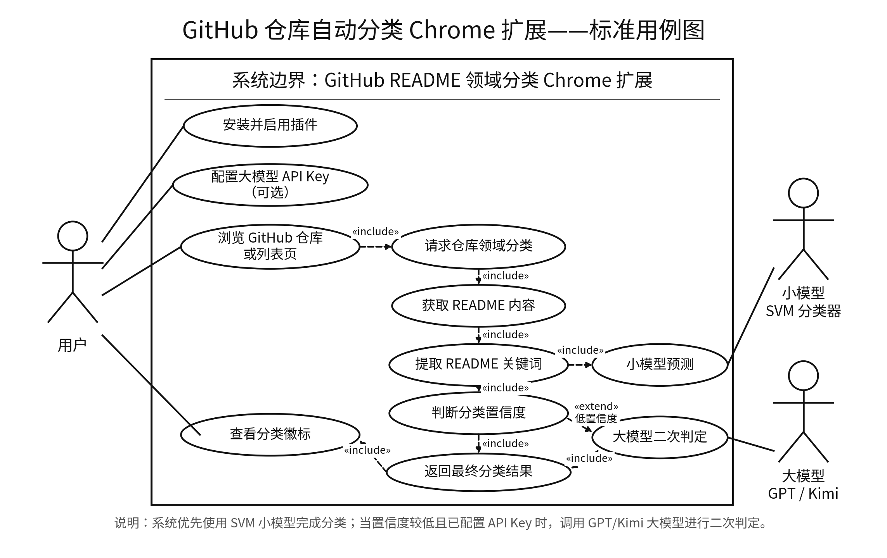
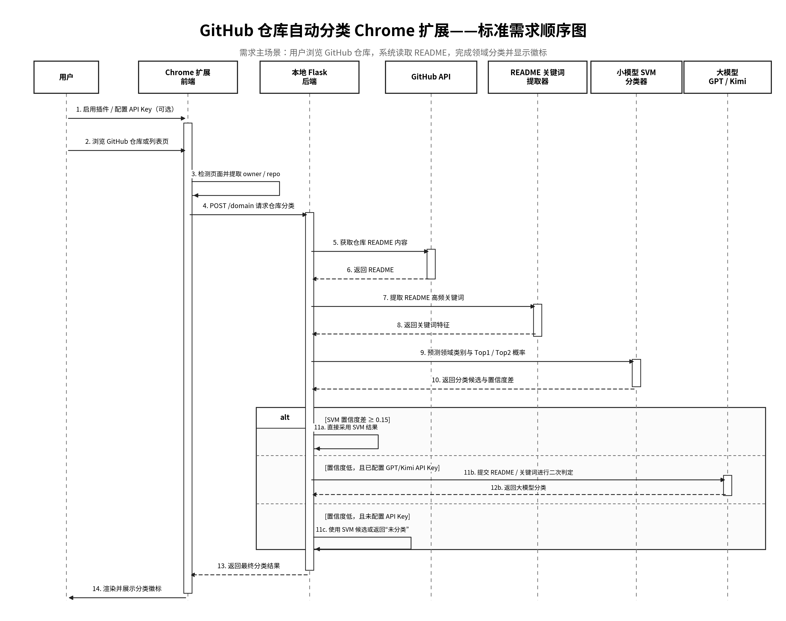
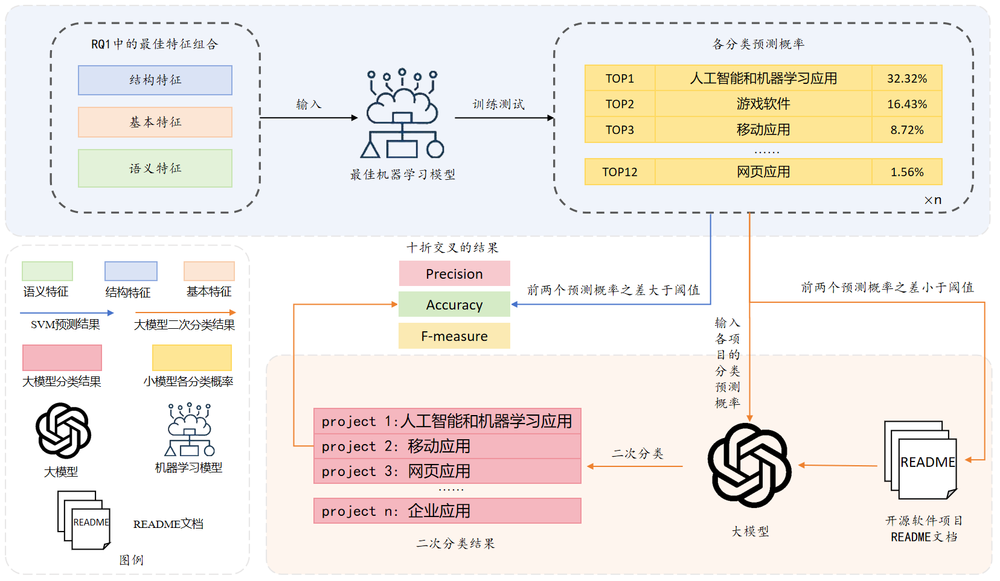
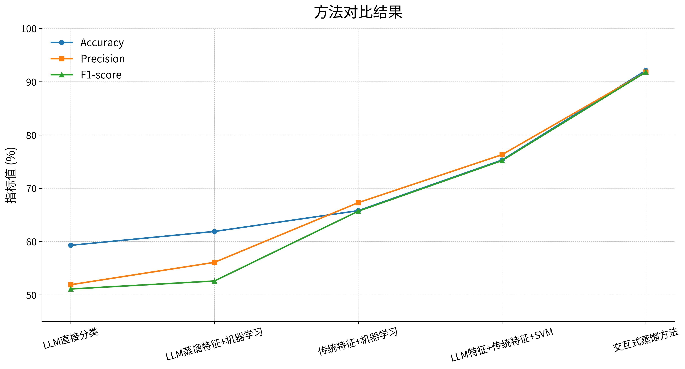
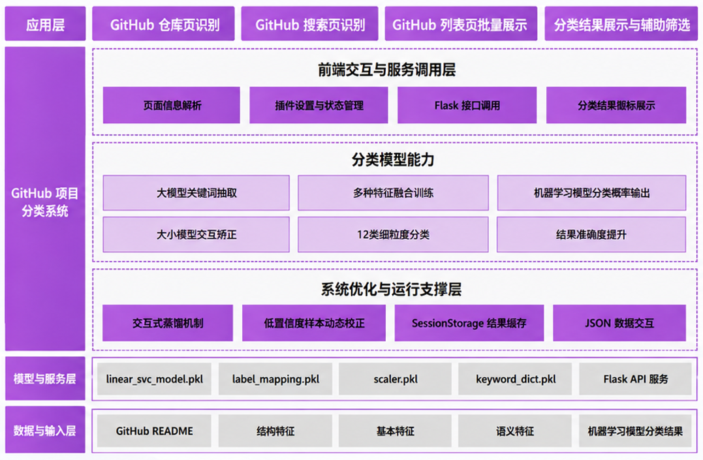
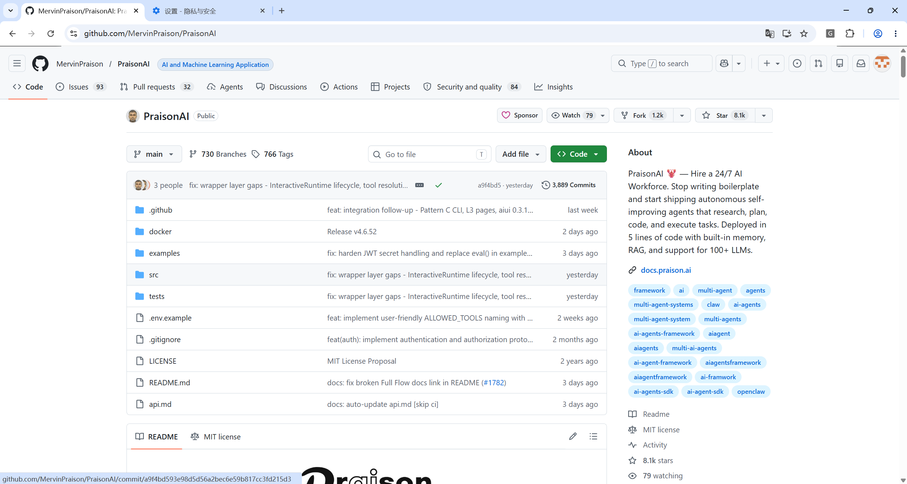
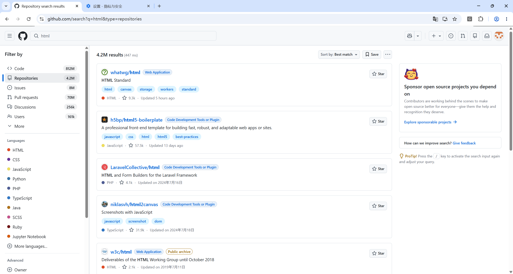
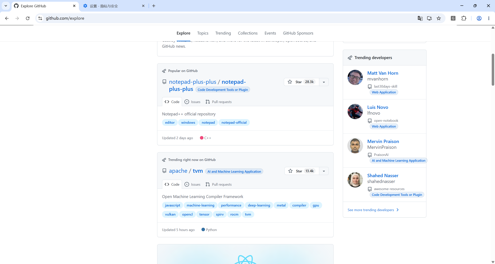

# GitHub Repository Domain Classifier


> 基于交互式蒸馏的 GitHub 开源仓库细粒度领域自动分类 Chrome 插件

GitHub Repository Domain Classifier 是一个面向 GitHub 开源仓库浏览场景的细粒度领域分类工具。项目通过 Chrome Extension 在仓库页面、搜索页、Trending 页、Topics 页等位置自动识别仓库类别，并将分类结果以徽标形式展示在页面中。

项目将论文中的“交互式蒸馏”方法工程化为可运行系统：先由 SVM 小模型完成快速分类，当分类置信度不足时，再调用大模型进行二次判定，从而兼顾分类效率与复杂样本判断能力。

---

## 1. 项目简介

本项目面向开发者、开源研究者和开源项目使用者，解决 GitHub 仓库领域类别难以快速识别的问题。

核心目标包括：

- 自动获取 GitHub 仓库 README 与基础信息；
- 对开源仓库进行 12 类细粒度领域分类；
- 在 GitHub 页面中实时展示分类徽标；
- 使用 SVM + LLM 的协同策略提升低置信样本判断能力；
- 提供本地后端 API，便于扩展到批量分类、研究数据标注等场景。

### 用例图



### 需求顺序图



### 核心用例

| 用户角色 | 使用目标 | 项目能力 |
|---|---|---|
| GitHub 普通用户 | 快速判断仓库所属领域 | 仓库页面自动展示分类徽标 |
| 开源项目开发者 | 判断项目定位与相似项目类别 | 基于 README 与关键词特征进行分类 |
| 开源研究者 | 获取细粒度分类样本 | 支持稳定的后端分类 API |
| 项目体验者 | 快速理解系统价值 | 插件效果、架构图、实验结果集中展示 |

项目运行后，用户只需要正常浏览 GitHub 页面，即可在仓库名称旁看到自动生成的领域分类结果。

---

## 2. 支持的开源项目领域类别

项目支持 12 类开源项目领域分类，覆盖常见应用软件、开发工具、服务端项目、插件类项目以及无法明确识别的特殊项目。

| 序号 | 类别 | 说明 |
|---:|---|---|
| 1 | 桌面应用 | 运行在 Windows、macOS、Linux 等桌面环境中的应用程序 |
| 2 | 人工智能和机器学习应用 | 使用或实现 AI / ML 模型的应用、工具或平台 |
| 3 | 微信应用开发 | 面向微信小程序、微信插件、微信 API 集成的开发项目 |
| 4 | 企业应用 | 面向企业业务、管理系统、流程系统或组织级服务的软件 |
| 5 | 网页应用 | 运行在浏览器中的 Web 应用，通常包含前后端交互 |
| 6 | 移动应用 | 面向 Android、iOS 或跨平台移动端的应用程序 |
| 7 | 代码开发工具或插件 | 辅助代码编写、调试、构建、分析或 IDE 集成的工具 |
| 8 | 服务器应用 | 运行在服务器端，提供 API、后台任务或基础服务的项目 |
| 9 | 游戏软件 | 游戏、游戏引擎、游戏工具链或图形渲染相关项目 |
| 10 | 应用插件 | 依赖宿主应用运行，用于扩展现有软件能力的插件 |
| 11 | 其他 | 不属于上述主要类别，但仍具有可识别用途的项目 |
| 12 | 未分类 | README 或项目信息过少，无法可靠判断类别的项目 |

该分类体系适用于 GitHub 仓库浏览、项目检索、开源生态分析和研究数据预处理等任务。

---

## 3. 方法设计：交互式蒸馏分类框架

项目采用“小模型快速分类 + 大模型低置信修正”的交互式蒸馏框架。



整体流程如下：

1. Chrome 插件识别当前 GitHub 页面中的仓库信息；
2. 前端向本地 Flask 后端发送仓库 `owner/repo`；
3. 后端通过 GitHub API 获取仓库 README；
4. 系统抽取 README 关键词与文本特征；
5. SVM 小模型输出类别概率分布；
6. 根据 Top1 与 Top2 概率差判断是否需要大模型介入；
7. 返回最终分类结果，并由前端渲染到 GitHub 页面。

这种设计避免了对所有仓库直接调用大模型，在保证响应速度的同时，将大模型能力集中用于边界样本与低置信样本。

### 3.1 小模型初次分类

小模型分类阶段负责完成大多数仓库的快速判断。

| 环节 | 说明 |
|---|---|
| 输入 | GitHub 仓库 README、仓库基础信息、关键词特征 |
| 特征处理 | 文本清洗、关键词抽取、向量化、特征标准化 |
| 分类模型 | 训练好的 SVM 分类器 |
| 输出 | 12 类类别概率分布 |
| 优势 | 推理速度快、本地可运行、成本低、结果稳定 |

小模型适合处理类别特征明显的仓库。例如，README 中包含明显的 Web 框架、移动端框架、IDE 插件、服务端 API 等信息时，SVM 可以快速给出稳定判断。

### 3.2 低置信样本的大模型二次判定

当小模型对两个候选类别判断接近时，系统会触发大模型二次判定。

判定规则：

```text
confidence_gap = P(top1) - P(top2)

if confidence_gap >= 0.15:
    使用 SVM 分类结果
else:
    调用 LLM 进行二次判定
```

大模型二次判定主要用于处理以下情况：

- README 描述较长，但核心用途不明确；
- 项目同时具备多个领域特征；
- Top1 与 Top2 类别概率接近；
- 项目名称、描述、README 信息存在冲突；
- 单纯关键词匹配容易误判的仓库。

二次判定阶段会结合候选类别、README 语义信息和关键词特征，让大模型在限定类别范围内完成最终判断，减少开放式生成带来的不稳定性。

---

## 4. 实验结果与性能指标

实验基于 30,310 个已标注开源仓库，分类体系包含 12 个细粒度领域类别。模型性能采用十折交叉验证进行评估。



### 方法对比结果

| 方法 | Accuracy | Precision | F1-score |
|---|---:|---:|---:|
| LLM 直接分类 | 59.3% | 51.9% | 51.1% |
| LLM 蒸馏特征 + 机器学习 | 61.9% | 56.1% | 52.6% |
| 传统特征 + 机器学习 | 65.8% | 67.3% | 65.7% |
| LLM 特征 + 传统特征 + SVM | 75.3% | 76.3% | 75.2% |
| 交互式蒸馏方法 | **92.1%** | **91.8%** | **91.8%** |

从结果可以看出，单纯依赖大模型直接生成分类结果并不稳定；传统机器学习方法虽然具备较好的可控性，但在复杂语义场景下存在不足。

交互式蒸馏方法通过小模型承担主要推理任务，通过大模型修正低置信样本，在分类准确性、工程效率和调用成本之间取得了更好的平衡。

### 指标说明

| 指标 | 含义 |
|---|---|
| Accuracy | 全部样本中分类正确的比例 |
| Precision | 各类别预测结果的准确程度 |
| F1-score | Precision 与 Recall 的综合评价指标 |

---

## 5. 系统架构

系统由 Chrome Extension 前端、本地 Flask 后端、GitHub 数据获取模块、SVM 分类模块和 LLM 二次判定模块组成。



### 技术架构

| 层级 | 模块 | 主要职责 |
|---|---|---|
| 浏览器扩展层 | content script / popup / background | 页面解析、插件开关、请求后端、结果渲染 |
| 后端服务层 | Flask API | 接收分类请求，组织分类流程 |
| 数据获取层 | GitHub API Fetcher | 获取仓库 README 与基础信息 |
| 特征处理层 | Keyword Extractor / Vectorizer | 提取关键词、构造模型输入特征 |
| 模型推理层 | SVM Predictor | 输出类别概率分布 |
| 二次判定层 | GPT / Kimi Refiner | 对低置信样本进行语义判断 |
| 结果展示层 | Badge Renderer | 在 GitHub 页面中展示分类结果 |

### 核心功能

- 仓库详情页分类：在 GitHub 仓库标题附近展示领域徽标；
- 列表页批量分类：支持 Search、Trending、Topics、Explore 等页面；
- 插件开关控制：可通过 popup 快速启用或关闭分类功能；
- LLM 辅助判定：可配置 GPT 或 Kimi API Key；
- 本地后端推理：后端服务本地运行，便于调试和扩展；
- 低置信样本处理：通过阈值机制判断是否调用大模型。

整体架构强调“轻量前端 + 本地后端 + 可解释分类流程”，适合比赛展示、实际使用和后续研究扩展。

---

## 6. 后端 API 说明

后端提供仓库领域分类接口，供 Chrome Extension 或其他客户端调用。

默认服务地址：

```text
http://127.0.0.1:8000
```

### 6.1 分类接口

```http
POST /domain
```

接口功能：

| 项目 | 说明 |
|---|---|
| 请求方式 | POST |
| Content-Type | application/json |
| 功能 | 根据 GitHub 仓库信息返回领域分类结果 |
| 调用方 | Chrome Extension / API Client |
| 默认端口 | 8000 |

### 6.2 请求示例

```json
{
  "owner": "facebook",
  "repo": "react"
}
```

字段说明：

| 字段 | 类型 | 必填 | 说明 |
|---|---|---|---|
| owner | string | 是 | GitHub 仓库所属用户或组织 |
| repo | string | 是 | GitHub 仓库名称 |

也可以根据实际后端实现扩展为：

```json
{
  "url": "https://github.com/facebook/react"
}
```

### 6.3 响应示例

```json
{
  "success": true,
  "owner": "facebook",
  "repo": "react",
  "category": "网页应用",
  "confidence": 0.87,
  "source": "svm",
  "top_candidates": [
    {
      "label": "网页应用",
      "probability": 0.87
    },
    {
      "label": "代码开发工具或插件",
      "probability": 0.09
    }
  ]
}
```

响应字段说明：

| 字段 | 说明 |
|---|---|
| success | 请求是否成功 |
| owner | 仓库所属用户或组织 |
| repo | 仓库名称 |
| category | 最终分类结果 |
| confidence | 分类置信度 |
| source | 分类来源，可为 `svm` 或 `llm` |
| top_candidates | SVM 输出的候选类别及概率 |

异常响应示例：

```json
{
  "success": false,
  "message": "README not found or GitHub API request failed"
}
```

---

## 7. 测试

### 测试套件概览

项目测试覆盖后端分类服务、GitHub 数据获取、特征抽取、模型推理、LLM 二次判定、Chrome 插件页面解析和端到端分类链路。

| 测试模块 | 测试数量 | 覆盖范围 |
|---|---:|---|
| 后端 API | 8 | 分类接口、请求校验、异常响应 |
| GitHub 数据获取 | 6 | README 获取、仓库信息解析、超时处理 |
| 特征抽取 | 8 | 文本清洗、关键词抽取、向量化流程 |
| 模型推理 | 6 | SVM 分类、概率输出、标签映射 |
| 大模型二次判定 | 5 | 低置信样本识别、LLM refinement 流程 |
| Chrome 插件 | 8 | 仓库页面解析、徽标渲染、配置读取 |
| 集成测试 | 5 | 从 GitHub 页面到分类结果展示的完整链路 |

### 运行测试

安装测试依赖：

```bash
pip install pytest pytest-cov pytest-asyncio pytest-xdist
```

运行所有测试：

```bash
pytest tests/ -v
```

运行测试并生成覆盖率报告：

```bash
pytest tests/ --cov=backend --cov-report=html --cov-report=term-missing
```

查看覆盖率报告：

```bash
open htmlcov/index.html      # macOS / Linux
start htmlcov/index.html     # Windows
```

运行特定类型的测试：

```bash
pytest -m unit
pytest -m integration
pytest -m extension
```

并行运行测试：

```bash
pytest tests/ -n auto
```

运行指定测试文件：

```bash
pytest tests/backend/test_api_classify.py -v
pytest tests/integration/test_end_to_end_classification.py -v
```

### 测试覆盖率目标

- 目标覆盖率：>80%
- 当前覆盖率：查看 `htmlcov/index.html` 获取详细报告
- 测试文档：详见 `tests/README.md`

测试重点包括：

- 分类接口是否稳定返回标准 JSON；
- GitHub README 获取失败时是否正确降级；
- SVM 是否输出合法类别与概率；
- 低置信样本是否进入 LLM 二次判定；
- 插件是否能在 GitHub 页面正确渲染分类徽标。

### 持续集成

项目可通过 GitHub Actions 配置自动化测试流程，在每次提交或 Pull Request 时运行测试套件。

建议 CI 流程包括：

- 安装 Python 依赖；
- 运行单元测试；
- 运行集成测试；
- 生成覆盖率报告；
- 在测试失败时阻止合并。

---

## 8. 项目结构

```text
Automated-GitHub-Repository-Categorization-Chrome-Extension/
├── README.md                         # 项目主说明文档
├── .env.example                      # 环境变量示例文件
├── .gitignore                        # Git 忽略规则
├── requirements.txt                  # Python 后端依赖列表
├── package.json                      # Chrome Extension 检查与测试脚本配置
│
├── extension/                        # Chrome Extension 前端代码
│   ├── manifest.json                 # Chrome 插件清单文件，声明权限、脚本与匹配页面
│   ├── content.js                    # 内容脚本，负责解析 GitHub 页面并渲染分类徽标
│   ├── popup.html                    # 插件弹窗页面结构
│   └── popup.js                      # 插件弹窗交互逻辑、开关状态与配置读取
│
├── backend/                          # 本地后端分类服务
│   ├── domain_get.py                 # 后端服务入口，提供仓库领域分类 API
│   ├── readme_words.py               # README 文本获取与关键词处理相关逻辑
│   ├── svm_predictor.py              # SVM 小模型预测模块
│   ├── gpt_predictor.py              # GPT 大模型二次判定模块
│   ├── kimi_predictor.py             # Kimi / Moonshot 大模型二次判定模块
│   ├── linear_svc_model.pkl          # 已训练的 Linear SVC 分类模型
│   ├── scaler.pkl                    # 特征标准化器
│   ├── label_mapping.pkl             # 分类标签映射文件
│   ├── label_encoder.pkl             # 标签编码器
│   └── keyword_dict.pkl              # 关键词字典特征文件
│
├── experiments/                      # 实验流程与模型训练相关脚本
│   ├── 01_tfidf_keywords.py          # 基于 TF-IDF 的关键词提取实验
│   ├── 02_llm_keywords.py            # 基于 LLM 的关键词生成实验
│   ├── 03_repo_feature_extraction.py # 仓库基础特征抽取实验
│   ├── 04_structure_features.py      # 仓库结构特征构造实验
│   ├── 05_semantic_features.py       # 语义特征构造实验
│   ├── 06_model_comparison.py        # 不同分类模型对比实验
│   ├── 07_small_model_probabilities.py
│   │                                  # 小模型概率输出与置信度分析
│   ├── 08_llm_interactive_correction.py
│   │                                  # LLM 交互式修正实验
│   ├── 09_result_integration.py      # 实验结果整合脚本
│   ├── 10_final_evaluation.py        # 最终性能评估脚本
│   └── README.md                     # 实验目录说明文档
│
├── tests/                            # 自动化测试目录
│   ├── README.md                     # 测试目录说明
│   │
│   ├── backend/                      # 后端相关测试
│   │   ├── test_api_classify.py      # 分类 API 测试
│   │   ├── test_feature_extractor.py # 特征抽取逻辑测试
│   │   ├── test_model_predictor.py   # SVM 模型预测逻辑测试
│   │   └── test_llm_refiner.py       # LLM 二次判定逻辑测试
│   │
│   ├── extension/                    # Chrome Extension 前端测试
│   │   ├── test_badge_rendering.js   # 分类徽标渲染测试
│   │   └── test_content_parser.js    # GitHub 页面解析测试
│   │
│   ├── integration/                  # 集成测试
│   │   └── test_end_to_end_classification.py
│   │                                  # 从输入仓库到分类结果的端到端测试
│   │
│   └── fixtures/                     # 测试样例数据
│       ├── sample_readme_plugin.md   # 插件类项目 README 样例
│       ├── sample_readme_web.md      # Web 类项目 README 样例
│       └── sample_response.json      # 模拟 API 响应数据
│
├── docs/                             # 项目中文文档
│   ├── api.md                        # 后端 API 使用说明
│   ├── categories.md                 # 12 类领域分类体系说明
│   ├── method.md                     # 方法设计与交互式蒸馏流程说明
│   └── testing.md                    # 测试方案、运行方式与覆盖范围说明
│
├── assets/                           # README 与文档使用的图片资源
│   ├── use-case-diagram.png          # 用例图
│   ├── requirement-sequence-diagram.png
│   │                                  # 需求顺序图
│   ├── interactive-distillation-workflow.png
│   │                                  # 交互式蒸馏流程图
│   ├── performance-comparison.png    # 性能对比图
│   ├── system-architecture.png       # 系统架构图
│   ├── demo-repo-page.png            # 仓库详情页插件效果图
│   ├── demo-search-page.png          # 搜索页插件效果图
│   └── demo-popup.png                # 插件弹窗效果图
│
└── .github/                          # GitHub 配置目录
    └── workflows/
        └── ci.yml                    # GitHub Actions 持续集成配置
```

---

## 9. 配置说明

项目通过 `.env` 文件管理后端服务、GitHub Token 和大模型 API Key。

### 环境变量

```env
# Backend
BACKEND_HOST=127.0.0.1
BACKEND_PORT=8000
CONFIDENCE_THRESHOLD=0.15

# GitHub
GITHUB_TOKEN=your_github_token

# LLM Provider
ENABLE_LLM_REFINE=true
LLM_PROVIDER=kimi

# Kimi / Moonshot
KIMI_API_KEY=your_kimi_api_key
KIMI_BASE_URL=https://api.moonshot.cn/v1
KIMI_MODEL=kimi-k2-turbo-preview
```

### 配置项说明

| 配置项 | 说明 |
|---|---|
| BACKEND_HOST | 后端服务监听地址 |
| BACKEND_PORT | 后端服务端口 |
| CONFIDENCE_THRESHOLD | Top1 与 Top2 概率差阈值 |
| GITHUB_TOKEN | GitHub API Token，用于提高请求限额 |
| ENABLE_LLM_REFINE | 是否启用大模型二次判定 |
| KIMI_API_KEY | Kimi API Key |

如果未配置 LLM API Key，系统仍可使用 SVM 完成本地分类，但低置信样本不会进入大模型二次判定。

---

## 10. 快速开始

### 10.1 环境准备

请确保本地已安装：

- Python 3.12+
- Google Chrome / Chromium
- Git
- pip
- 可访问 GitHub API 的网络环境

克隆项目：

```bash
git clone https://github.com/BINGOik/Automated-GitHub-Repository-Categorization-Chrome-Extension.git
cd Automated-GitHub-Repository-Categorization-Chrome-Extension
```

创建虚拟环境:

```bash
python -m venv .venv
```

激活虚拟环境:

```bash
# Windows
.venv\Scripts\activate
```

安装依赖:

```bash
pip install -r requirements.txt
```

复制环境变量文件:

```bash
cp .env.example .env
```

根据需要编辑 `.env`，配置 `GITHUB_TOKEN` 和 LLM API Key。

### 10.2 后端服务启动

进入后端目录：

```bash
cd backend
```

启动 Flask 服务：

```bash
python domain_get.py
```

启动成功后，默认服务地址为：

```text
http://127.0.0.1:8000
```

分类接口地址：

```text
http://127.0.0.1:8000/domain
```

可使用以下命令快速测试：

```bash
curl -X POST "http://127.0.0.1:8000/domain" \
  -H "Content-Type: application/json" \
  -d '{
    "owner": "facebook",
    "repo": "react"
  }'
```

### 10.3 Chrome 扩展安装

1. 打开 Chrome 浏览器；
2. 访问 `chrome://extensions/`；
3. 开启右上角“开发者模式”；
4. 点击“加载已解压的扩展程序”；
5. 选择项目中的 `extension/` 目录；
6. 确认后端服务已启动；
7. 访问任意 GitHub 仓库页面，查看分类徽标。

插件支持的页面包括：

- GitHub 仓库详情页；



- GitHub Search 结果页；



- GitHub Explore 页面。



---

## 11. 应用场景

### 开源仓库浏览辅助

用户在浏览 GitHub 仓库时，可以快速判断项目属于 Web 应用、服务端应用、开发工具、AI 应用等类别，减少人工阅读 README 的时间。

### 开源项目检索与筛选

在搜索页、Trending 页和 Topics 页中批量展示分类结果，帮助用户更快筛选目标领域项目。

### 开源生态研究

研究者可以利用后端 API 对仓库样本进行自动分类，为开源项目演化、领域差异分析、社区生态研究提供数据基础。


### 企业技术选型

企业或团队在调研开源组件时，可以通过分类结果快速识别候选项目所属领域，辅助技术选型和项目评估。

---

## 12. License

This project is licensed under the MIT License.

See the [LICENSE](./LICENSE) file for details.
